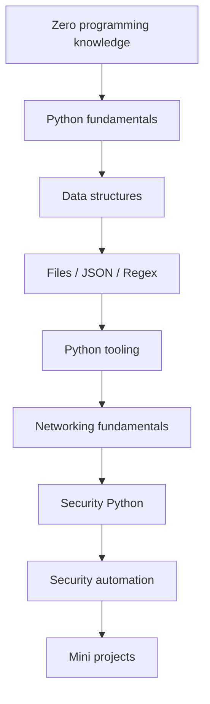

# Learning roadmap

Follow the arrows in order. Each stage uses ideas from earlier stages, so a little daily practice is more useful than skipping ahead.

## Suggested eight-week plan

| Week | Study focus | Practice outcome |
|---|---|---|
| 1 | Install tools, terminal, first program, variables, types | Run and modify short scripts |
| 2 | Operators, conditions, loops | Make decisions and repeat useful work |
| 3 | Functions, scope, errors, lists, tuples | Break a problem into small steps |
| 4 | Dictionaries, sets, files, paths | Store and read simple security records |
| 5 | CSV, JSON, regex, modules, environments | Process structured data reproducibly |
| 6 | IP addresses, ports, TCP/UDP, HTTP | Explain what a safe client program does |
| 7 | Hashes, secure coding, log analysis | Summarize synthetic events defensively |
| 8 | Labs 8–10 and mini project | Build and explain one small defensive tool |

Aim for three or four study sessions each week, around 45–75 minutes per session. In each session, read one page, type its example, then attempt one exercise without looking at the solution. If setup takes longer, let week one take longer.

## Checkpoints

Before moving from fundamentals, you should be able to read a short script aloud and explain what each line does. Before the security module, you should be comfortable with lists, dictionaries, functions, loops, and reading a file. The [glossary](glossary.md) defines new computing terms as they appear.
